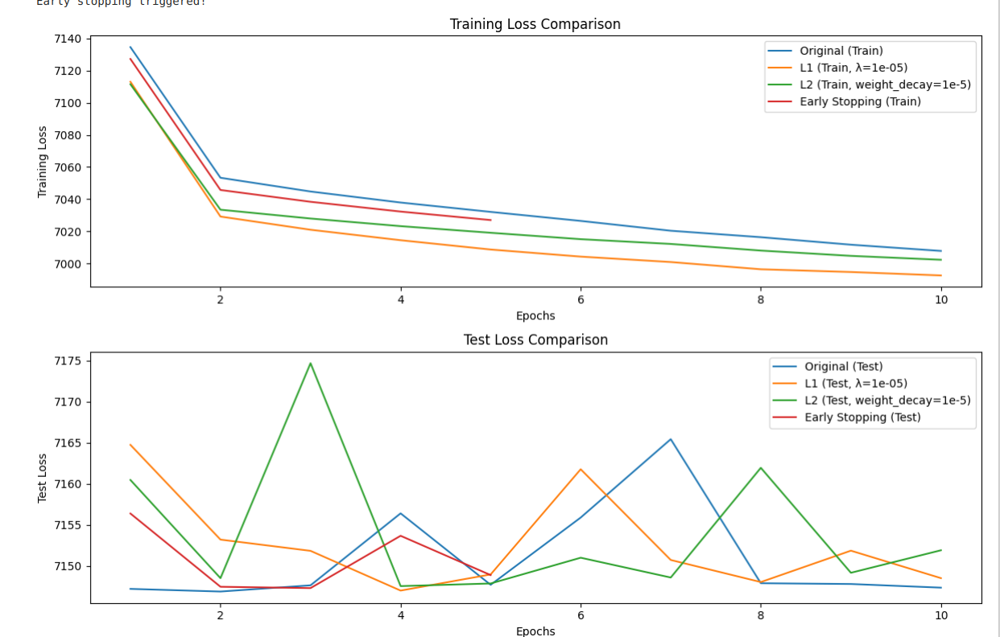
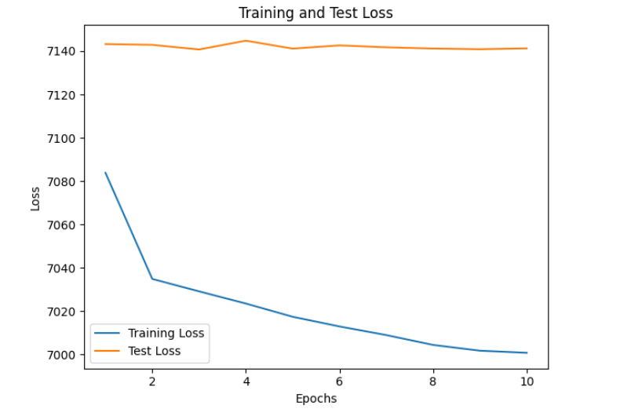

# Stock Price Prediction with Deep Learning using PyTorch

This project explores stock price prediction using a Deep Neural Network (DNN) implemented with PyTorch. The analysis includes Exploratory Data Analysis (EDA), model building, hyperparameter tuning, and comparison of different regularization techniques.

## Dataset

The dataset used is the  NYSE dataset, available on Kaggle. It contains historical stock prices for a number of companies traded on the New York Stock Exchange (NYSE) from 2016 to 2017.  The specific file used for this project is `prices.csv`, though the overall dataset includes additional information about company fundamentals.

## 1. Exploratory Data Analysis (EDA)

The notebook `regression.ipynb` starts with an EDA section to understand the dataset. Key steps include:

*   **Loading and Inspecting Data:**  Loading the `prices.csv` file into a Pandas DataFrame and displaying the first few rows using `df.head()`.

*   **Data Information:**  Using `df.info()` to understand data types, column names, and potential missing values.

*   **Missing Value Check:**  Using `df.isnull().sum()` to identify and quantify any missing data in the dataset.

*   **Summary Statistics:**  Using `df.describe()` to obtain descriptive statistics of the numerical features (mean, standard deviation, min, max, quartiles).

*   **Visualization:** Creating a histogram of the `close` prices to visualize the price distribution and plotting the `close` prices over time to see trends. Also, calculating and visualizing the correlation matrix as a heatmap.  The correlation matrix provides insights into the relationships between different features in the dataset.

## 2. Deep Neural Network Architecture

The core of the project involves building a regression model using PyTorch.  The model architecture is defined as follows:

*   **Model Class:** A custom `StockPriceRegressor` class inherits from `nn.Module`.
*   **Layers:**
    *   `fc1`: Linear layer (input size to 128 neurons) + ReLU activation + Dropout (0.3)
    *   `fc2`: Linear layer (128 to 64 neurons) + ReLU activation + Dropout (0.3)
    *   `fc3`: Linear layer (64 to 32 neurons) + ReLU activation
    *   `fc4`: Linear layer (32 to 1 neurons) - Output layer (no activation function for regression)
*   **Activation:** ReLU (Rectified Linear Unit) is used as the activation function for hidden layers.
*   **Regularization:** Dropout layers are included after the ReLU activations to prevent overfitting.
*   **Forward Pass:**  The `forward` method defines how the input data flows through the network.

## 3. Hyperparameter Tuning with GridSearch

GridSearchCV is used to find the best combination of hyperparameters.  The following hyperparameters are tuned:

*   **Learning Rate:** `0.01`
*   **Optimizer:** `optim.Adam`
*   **Layer Sizes:** `(128, 64)` (representing the number of neurons in the first two hidden layers)
*   **Batch Size:** `32`
*   **Dropout Rate:** `0.3`

   (Note: To speed up execution, a smaller grid is used. In a real-world scenario, a wider range of hyperparameters should be explored.)

## 4. Visualization of Training & Test Loss

Loss curves are plotted for both the training and test datasets.

*   **Loss Curves (training_and_test_loss.png in the same file):** These plots illustrate how the loss function (Mean Squared Error in this case) changes over epochs during training and on the test dataset.

*   **Interpretation of Loss Curves:**
    *   A significant gap between the training and test loss suggests overfitting, indicating that the model is memorizing the training data but not generalizing well to unseen data.
    *   If both training and test loss are high, the model may be underfitting.

## 5. Regularization Techniques

Several regularization techniques are implemented and compared:

*   **Original Model (No Regularization):**  A baseline model without any explicit regularization.
*   **L1 Regularization:**  Adds a penalty term to the loss function proportional to the absolute value of the weights.
*   **L2 Regularization:**  Adds a penalty term to the loss function proportional to the square of the weights (implemented through `weight_decay` in the Adam optimizer).
*   **Early Stopping:**  Monitors the test loss during training and stops when it starts to increase, preventing overfitting.  A patience value determines how many epochs to wait for improvement before stopping.

**Comparison:**

The following table summarizes the final test losses for each model:

| Model                       | Final Test Loss |
| --------------------------- | --------------- |
| Original Model               | 7147.3488       |
| L1 Regularized Model         | 7148.5059       |
| L2 Regularized Model         | 7151.8995       |
| Early Stopping Model         | 7148.8793       |

**Interpretations:**

*   In this specific example, the regularization techniques did not significantly improve the test loss. In some cases, test loss even increased slightly. This could indicate that the initial model wasn't severely overfitting, or that the chosen regularization parameters were not optimal.
*   **L1 Regularization:** can lead to sparsity (some weights become zero), which can simplify the model.
*   **L2 Regularization:** penalizes large weights, promoting a smoother model and preventing overfitting.
*   **Early stopping:** prevents overfitting by stopping training when the performance on the validation set starts to degrade.
*   Compare the training and test loss curves.  A large gap between training and test loss suggests overfitting.
*   Regularization techniques are most effective when overfitting is a problem.

## Key Improvements Implemented:

*   **Batch Processing for test data:** Addressing the CUDA memory issue
*   **CUDA optimization:** for GPU training
*   **Efficient Data Loaders:** Using `num_workers` and `pin_memory=True`
*   **NaN Handling:** Includes handling for any NaN during hyperparameter tuning
*   **ValueError handling:** Includes handling for ValueErrors during testing

## Running the Code

1.  **Install Dependencies:**  Ensure you have the necessary libraries installed.  Run:

    ```bash
    pip install pandas scikit-learn matplotlib seaborn torch
    ```

2.  **Download the Dataset:**  Download the `prices.csv` file from the specified Kaggle dataset and place it in the same directory as the `regression.ipynb` notebook.

3.  **Execute the Notebook:** Open `regression.ipynb` in a Jupyter Notebook environment (e.g., Jupyter Lab, Google Colab) and run the cells sequentially.

## Next Steps

*   **Explore More Hyperparameter Combinations:** Expand the range of learning rates, optimizers, batch sizes, and dropout rates in the `hyperparameter_tuning` function.
*   **Experiment with Different Model Architectures:** Try different numbers of layers, different activation functions (e.g., Sigmoid, Tanh), and different layer sizes.
*   **Feature Engineering:** Create new features from the existing ones (e.g., moving averages, technical indicators).
*   **Use a Validation Set:**  Implement a separate validation set to more accurately monitor performance during training and guide early stopping.
*   **Different Dataset Split:** For time-series data, it is crucial to preserve the temporal order when splitting the data.  Using methods such as timeseries split is important

By completing the previous steps in this guide, one can gain a solid understanding of how to perform the tasks and can help in developing the current work.
