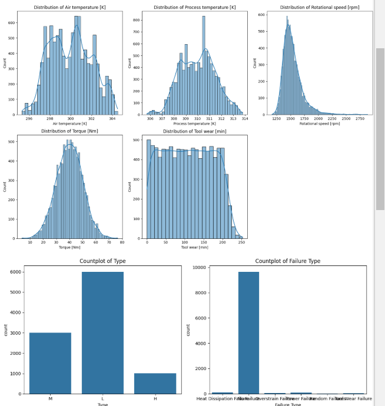
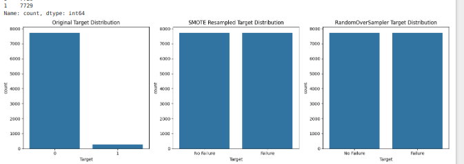
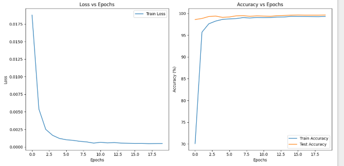

# screenshots

# Predictive Maintenance Classification with PyTorch

## Dataset
`predictive_maintenance.csv` in https://www.kaggle.com/datasets/dgawlik/nyse

## 1. Exploratory Data Analysis (EDA)

The notebook `part2.ipynb` starts with an EDA section to understand the dataset. The steps include:

*   Loading and Inspecting Data
*   Data Information and Summary Statistics
*   Checking for Missing Values
*   Visualizations:
    *   Distribution of Numerical Features
    *   Distribution of Categorical Features
    *   Boxplots of Numerical Features vs. Target Variable
    *   Correlation Matrix
    *   Failure Type by Target Distribution

## 2. Model Definition

A DNN classifier is built using PyTorch. The model architecture consists of linear layers with ReLU activations, batch normalization, and dropout regularization.

## 3. Hyperparameter Tuning

GridSearchCV from `sklearn` is used to tune the following hyperparameters:

*   Learning Rate
*   Hidden Units
*   Optimizer Type
*   Number of Epochs

## 4. Performance Evaluation

*   Metrics: Accuracy, precision, recall, and F1-score are calculated for both the training and test sets.
*   Confusion Matrix: Visualizes the performance of the model.
*   Classification Report: Provides a detailed breakdown of precision, recall, F1-score, and support for each class.
*   Visualization of Training Progress: Plots training and test loss, and training and test accuracy over epochs.

**Key Results**
*After training, you would include the key results from the hyperparameter tuning and performance evaluation.*

